# Nilotica

<p align="center">
  
</p>

中文 | [ENGLISH](README_EN.md)

## 基于vnpy的期货量化交易系统

[](https://deepwiki.com/Lumosylva/Nilotica)&ensp;[](https://opensource.org/licenses/MIT)&ensp;&ensp;[](https://qun.qq.com/universal-share/share?ac=1&authKey=dzGDk%2F%2Bpy%2FwpVyR%2BTrt9%2B5cxLZrEHL793cZlFWvOXuV5I8szMnOU4Wf3ylap7Ph0&busi_data=eyJncm91cENvZGUiOiI0NDYwNDI3NzciLCJ0b2tlbiI6IlFrM0ZhZmRLd0xIaFdsZE9FWjlPcHFwSWxBRFFLY2xZbFhaTUh4K2RldisvcXlBckZ4NVIrQzVTdDNKUFpCNi8iLCJ1aW4iOiI4MjEzMDAwNzkifQ%3D%3D&data=O1Bf7_yhnvrrLsJxc3g5-p-ga6TWx6EExnG0S1kDNJTyK4sV_Nd9m4p-bkG4rhj_5TdtS5lMjVZRBv4amHyvEA&svctype=4&tempid=h5_group_info) 

------

### **1. 前言**

本项目以 [vnpy](https://github.com/vnpy/vnpy) 与 [vnpy_ctp](https://github.com/vnpy/vnpy_ctp) 为基石，vnpy 作为开源量化交易平台开发框架，凭借丰富组件、灵活架构，为策略设计、交易执行全方位支撑；vnpy_ctp 则深度对接国内期货市场，确保交易信号精准传递、交易执行高效顺畅。

项目致力于降低国内期货量化交易准入门槛，助力手动交易者轻松跨越至量化交易领域，使其摆脱繁琐技术束缚，心无旁骛投身策略创意构思与优化打磨，尽情探索量化交易无限可能，畅享技术赋能交易升级新体验。

目前系统已实现的功能：

- 行情网关
- 订单执行网关
- 策略引擎
- 风控管理
- 数据记录
- 策略回测
- 行情回放

### **2. 基础环境**

- **Python** ：`3.12.9`版本

- **工具链**：uv + hatch + setuptools

- **vnpy** ：`4.0.0`版本

- **vnpy_ctp**： `6.7.7.1`版本（基于CTP期货版的`6.7.7`接口封装开发，接口中自带的是【穿透式实盘环境】的dll文件）

- 若需要其他版本CTP C++ 编译，需要在执行下述命令之前请确保已经安装了`Visual Studio`（`Windows`）、`GCC`（`Linux`）

- 若直接使用本系统的CTP版本，则不需要进行下方第4步的构建流程，直接下载 [Releases](https://github.com/Lumosylva/Nilotica/releases) 包中 `whl`文件，然后 `uv pip install` 安装即可

- **注意**：目前所有代码仅在 Windows 环境下进行测试，Linux 下并未做测试

### **3. 说明**

本项目修改了 vnpy 库中部分源代码文件。

### **4. 环境配置**

本项目使用`uv`管理Python虚拟环境及依赖的软件包，`hatch`作为构建工具

- 安装uv

   On Windows

   ```bash
   powershell -ExecutionPolicy ByPass -c "irm https://astral.sh/uv/install.ps1 | iex"
   ```

   On Linux

   ```bash
   curl -LsSf https://astral.sh/uv/install.sh | sh
   ```

- 安装指定版本 Python

   ```bash
   uv python install 3.12.9
   ```

- 使用 `uv sync`命令让`uv`根据`pyproject.toml`中的配置，自动进行Python虚拟环境的创建和依赖包的下载

   ```bash
   uv sync
   ```

   或不使用`uv sync`命令，手动创建虚拟环境

   ```bash
   uv venv --python 3.12.9 .venv
   ```

   激活虚拟环境

   ```bash
   .venv\Scripts\activate
   ```

- 安装ta_lib库

   On Windows

   ```bash
   install_ta_lib.bat
   ```

   On Linux

   ```bash
   install_ta_lib.sh
   ```


### **5. 编译VNPY_CTP**

需要对`vnpy_ctp`编译时，执行 `hatch build` 命令将会在项目 vnpy_ctp\api\ 下利用`hatch_build.py`构建脚本，编译vnctpmd和vnctptd模块为.pyd文件（在Windows上）或.so文件（在Linux上），并生成对应的Python接口存根文件（.pyi）。该脚本使用了pybind11库来简化C++与Python之间的绑定过程，并通过setuptools和hatchling来执行构建操作。

需要对`vnpy_tts`编译时，请修改`pyproject.toml`中`[tool.hatch.build.hooks.custom]`构建脚本的`path`为`hatch_build_tts.py`，再执行`hatch build`可编译同上述类似的过程。

#### **(1) 清理旧的构建**

打开终端进入项目根目录，删除`dist`、`build`目录

PowerShell 

```bash
Remove-Item -Recurse -Force dist, build -ErrorAction SilentlyContinue
```

CMD

```bash
rmdir /s /q dist
rmdir /s /q build
```

Bash

```bash
rm -rf dist build
```

#### **(2) 执行构建**

方式一：

```bash
build.bat
```

或者

```bash
build.sh
```

方式二：

进入项目根目录，将ta-lib源文件目录加入临时环境变量（设置为你自己的实际路径），再执行hatch build

```bash
set TA_INCLUDE_PATH=D:\Project\PycharmProjects\Nilotica_dev\ta-lib\include
set TA_LIBRARY_PATH=D:\Project\PycharmProjects\Nilotica_dev\ta-lib\lib
```

或

```bash
export TA_INCLUDE_PATH="$PATH:/ta-lib/include"
export TA_LIBRARY_PATH="$PATH:/ta-lib/lib"
```

```bash
hatch build
```

构建效果如下：

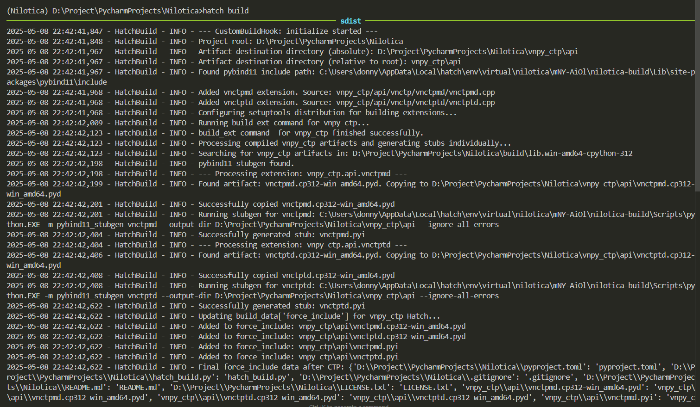

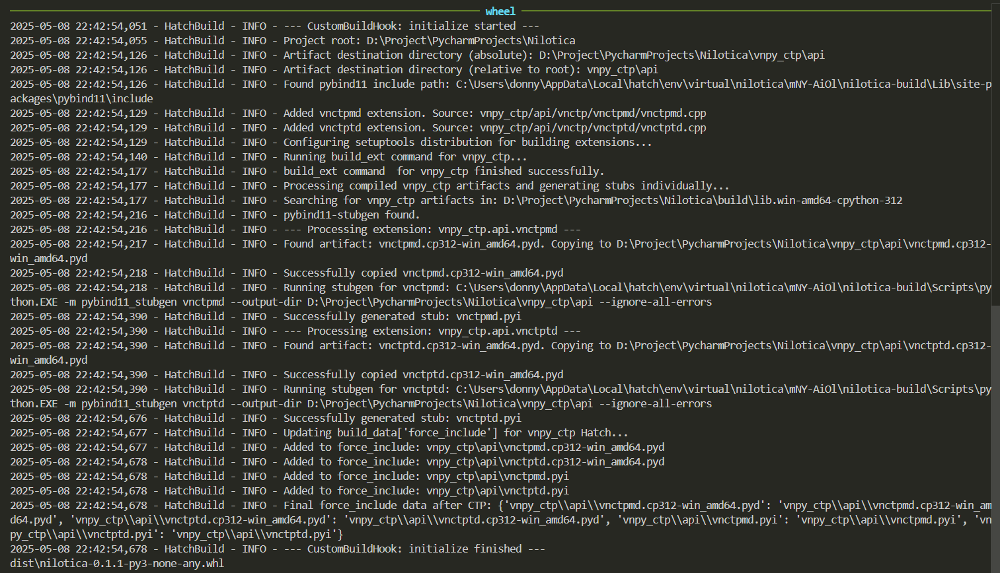

### **6. 项目结构**

```reStructuredText
.
├── assets - 图片资源文件
├── bat - Windows BAT服务启动脚本
│   ├── 1_run_market_gateway.bat - 行情网关启动脚本
│   ├── 2_run_order_gateway.bat - 订单执行网关启动脚本
│   ├── 3_run_strategy_engine.bat - 策略引擎启动脚本
│   ├── 4_run_risk_manager.bat - 风控管理启动脚本
│   ├── 5_run_data_recorder.bat - 数据记录启动脚本
│   └── 6_run_backtest.bat - 策略回测demo脚本
├── config - 项目配置目录
│   ├── constants - 常量目录
│   │   ├── params.py - 常量
│   │   └── path.py - 路径常量
│   └── project_files - 存放节假日、合约乘数和费率、合约和交易所映射等文件目录。
│   │   ├── backtest_config.yaml - 回测参数配置
│   │   ├── backtest_strategies_setting.json - 回测策略参数配置
│   │   ├── dev_config.yaml - 开发模式配置
│   │   ├── global_config.yaml - 全局配置
│   │   └── prod_config.yaml - 生产模式配置
├── locales - 国际化相关文件
│   ├── en/LC_MESSAGES - 英文翻译文件
│   ├── compile_translations_util.py - 国际化编译脚本
│   ├── language.json - 中英映射文件
│   ├── messages.pot - 国际化相关文件
│   └── translate_text_fill_util.py - 帮助填充翻译文本的脚本
├── ta-lib - ta-lib库源文件
├── utils - 工具类包，包含日志、路径等
│   ├── logger - 日志记录工具
│   ├── path - 路径工具
│   ├── config_manager.py - 配置管理
│   ├── config_models.py - 含PathsConfig、ZmqAddressesConfig、LoggingConfig、GlobalConfigStructure Pydantic 模型。
│   ├── converter.py - 对象转换为 msgpack 可序列化的工具。
│   └── i18n.py - 国际化相关工具
├── vnpy - vnpy官方的核心库，主要功能是事件驱动引擎。
├── vnpy_ctp - vnpy官方的ctp库，主要功能是提供底层与simnow和实盘行情和交易服务器交互的接口。
├── vnpy_tts - vnpy官方的tts库，主要功能是提供底层与tts和实盘行情和交易服务器交互的接口。
├── zmq_services - 系统核心，包括行情网关、订单执行网关、策略订阅器、风控管理、数据记录、策略回测、行情回放。
│   ├── backtester - 回测目录
│   │   ├── data_player.py - 数据回放
│   │   ├── performance.py - 计算性能指标，回测性能报告
│   │   ├── run_backtest.py - 运行回测脚本
│   │   ├── run_data_player.py - 运行数据回放脚本
│   │   └── simulation_engine.py - 模拟引擎
│   ├── strategies - 策略存放位置
│   ├── recorded_data - accounts、tick、order、trader数据本地存储目录
│   ├── dev_recorded_data - 开发模式数据存放目录
│   ├── data_recorder.py - 数据记录器
│   ├── market_data_gateway.py - 行情网关
│   ├── order_execution_gateway.py - 订单执行网关
│   ├── risk_manager.py - 风控管理器
│   ├── rpc_client_test.py - 下单测试脚本
│   ├── run_data_recorder.py - 数据记录器启动脚本
│   ├── run_market_gateway.py - 行情网关启动脚本
│   ├── run_order_gateway.py - 订单执行网关启动脚本
│   ├── run_risk_manager.py - 风控管理器启动脚本
│   ├── run_strategy_engine.py - 策略引擎启动脚本
│   ├── strategy_base.py - 策略基类
│   ├── zmq_base.py - 用于管理 ZMQ Context 和 PUB Socket的基类
│   └── strategy_engine.py - 策略引擎
├── .python-version - 项目使用的Python版本号，由uv自动生成不用手动编辑。
├── CHANGELOG.md - 系统版本更新日志
├── CODE_OF_CONDUCT.md - 行为守则
├── LICENSE.txt - license文件
├── README.md - 项目中文说明
├── README_EN.md - 项目英文说明
├── __init__.py - 项目的版本号
├── babel.cfg - babel翻译的配置文件
├── build.bat - Windows项目自动构建脚本
├── build.sh - Linux项目自动构建脚本
├── hatch_build.py - vnpy_ctp构建脚本负责编译 C++ 扩展
├── hatch_build_tts.py - vnpy_tts构建脚本负责编译 C++ 扩展
├── install_ta_lib.bat - Windows安装ta-lib 0.6.3的脚本
├── install_ta_lib.sh - Linux安装ta-lib 0.6.3的脚本
├── locales.bat - 辅助国际化的脚本
├── locales.sh - 辅助国际化的脚本
├── main.py - 项目主文件，暂时无定义
├── pyproject.toml - 项目配置文件，由uv自动生成，用于定义项目的主要依赖、元数据、构建系统等信息。
├── run.bat - Windows脚本，一键启动行情网关、订单执行网关、策略订阅器、风控管理、数据记录脚本
├── run.sh - Linux脚本，一键启动行情网关、订单执行网关、策略订阅器、风控管理、数据记录脚本
└── uv.lock - 记录项目的所有依赖，由uv自动管理，不用手动编辑。
```

### **7. 服务运行展示**

1. 运行行情网关：

   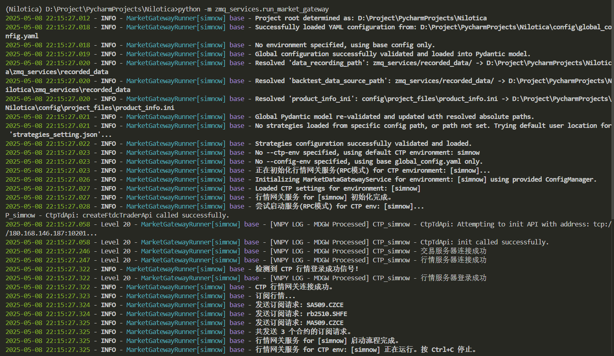

2. 运行订单执行网关：

   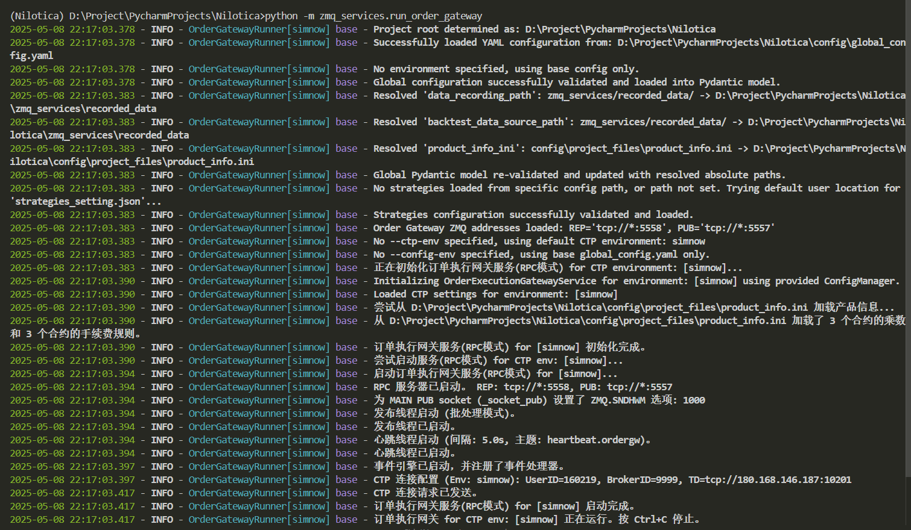

   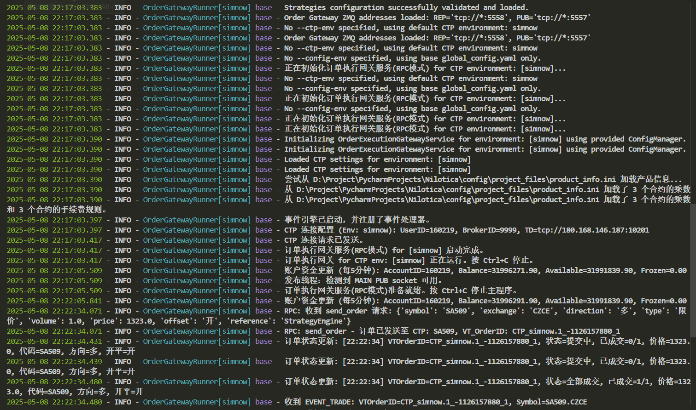

3. 运行策略引擎：

   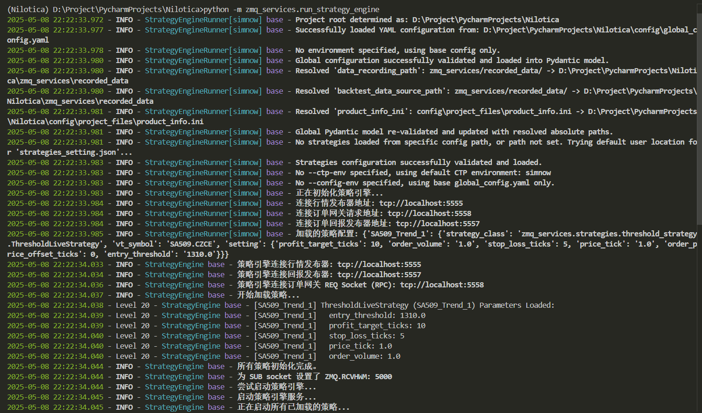

   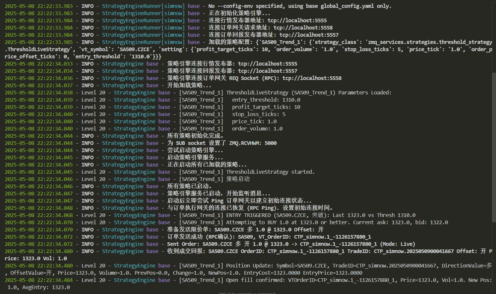

4. 运行风控管理：

   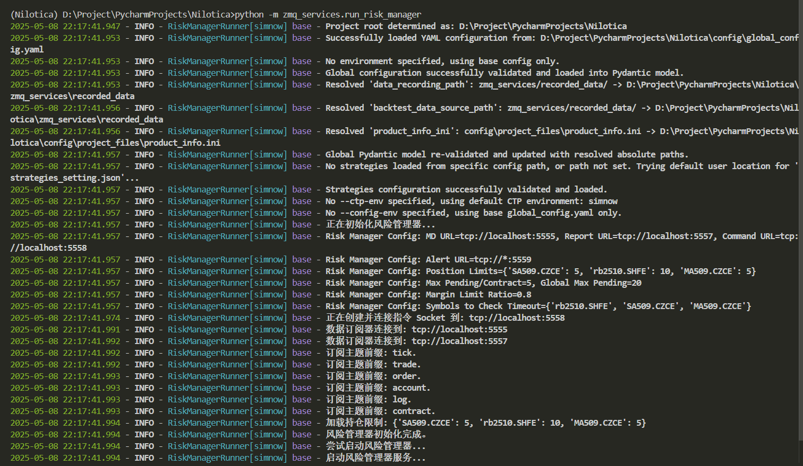

   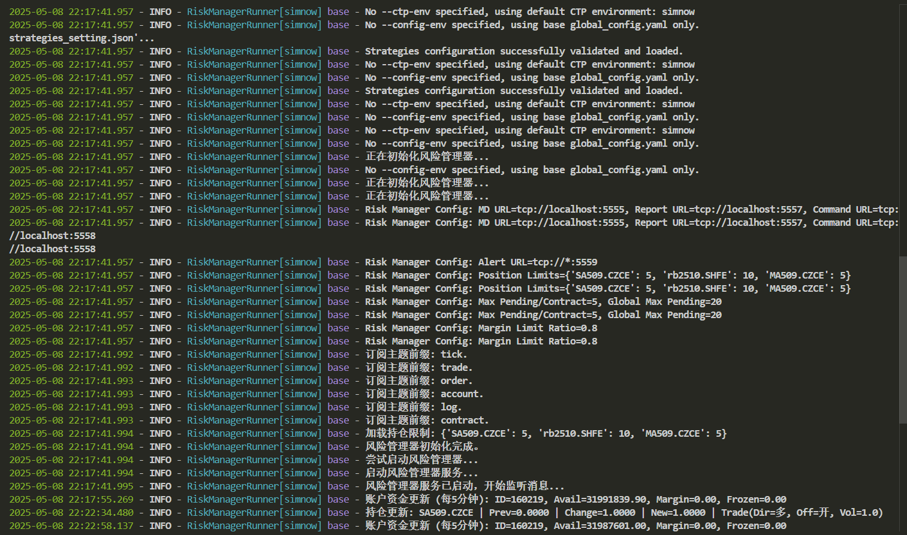

5. 运行数据记录：

   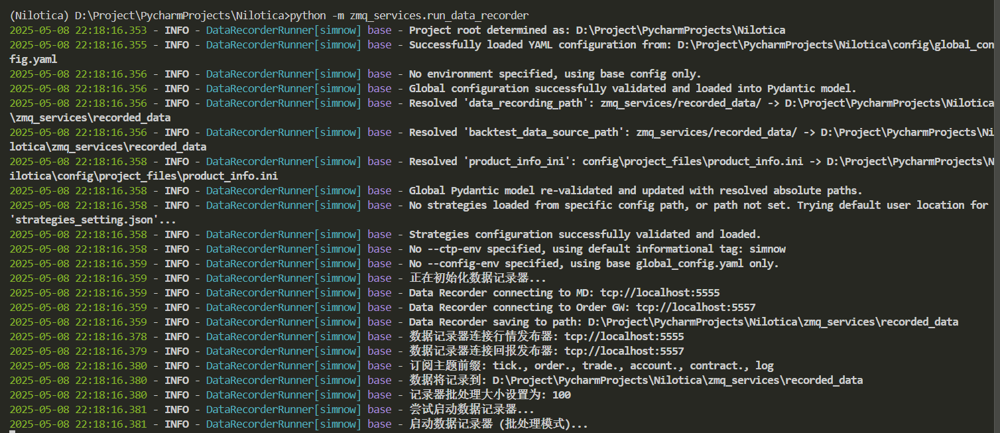

6. 运行回测

   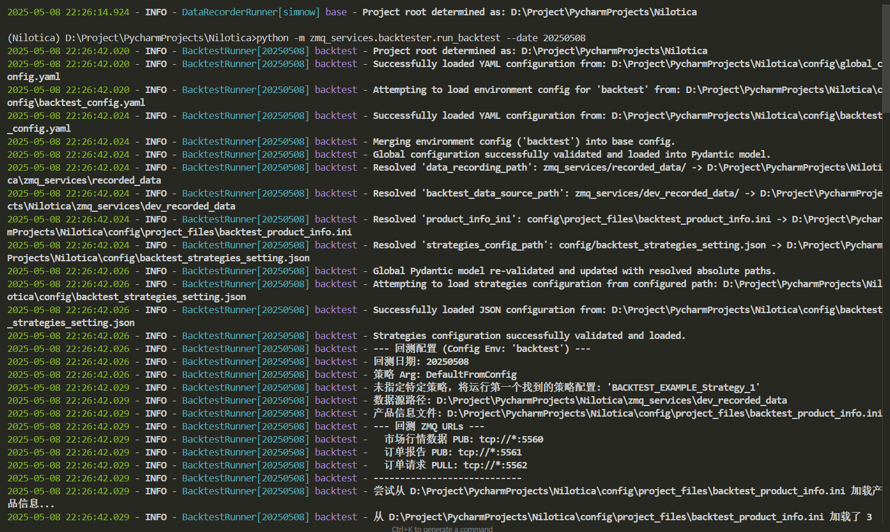

   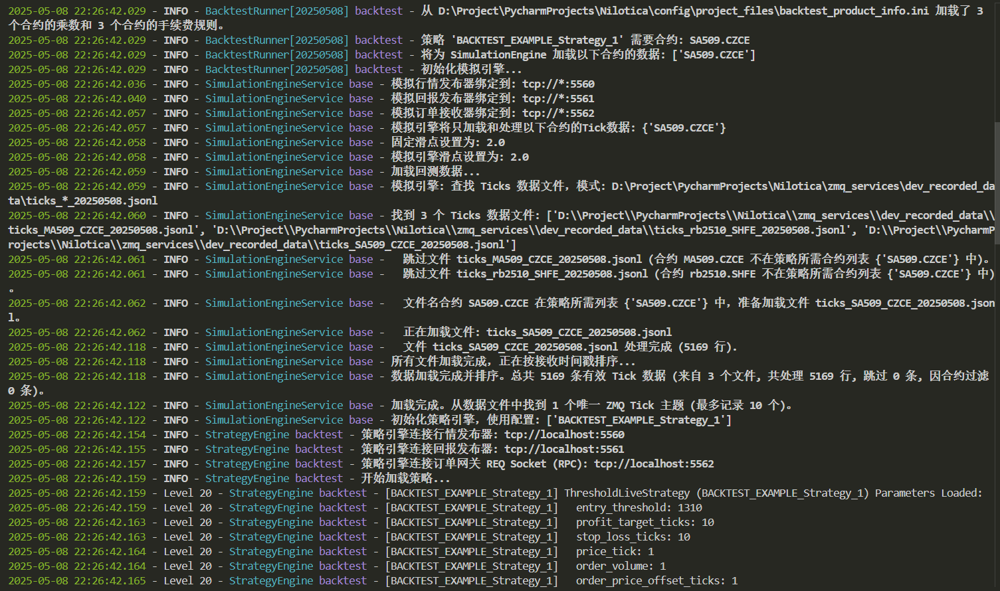

   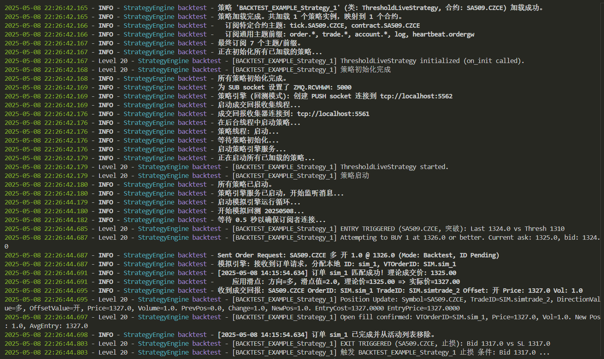
   
   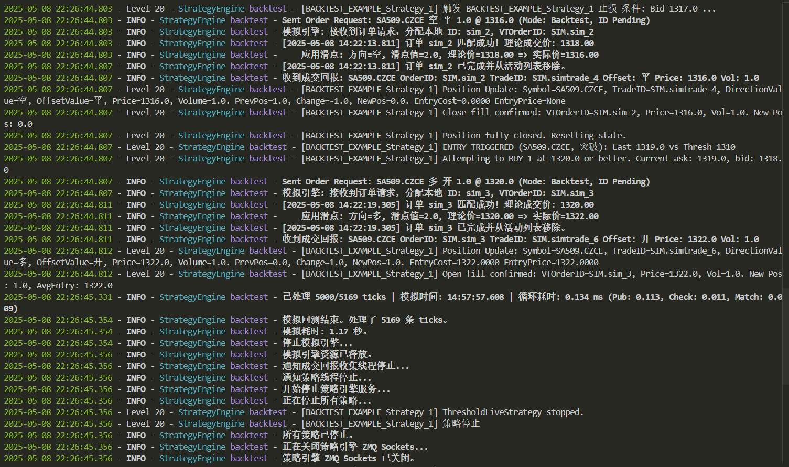
   
   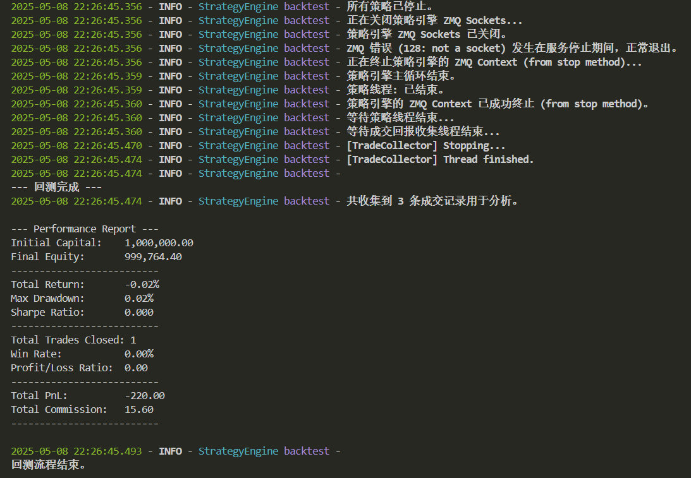
   
   7. 数据回放
   
      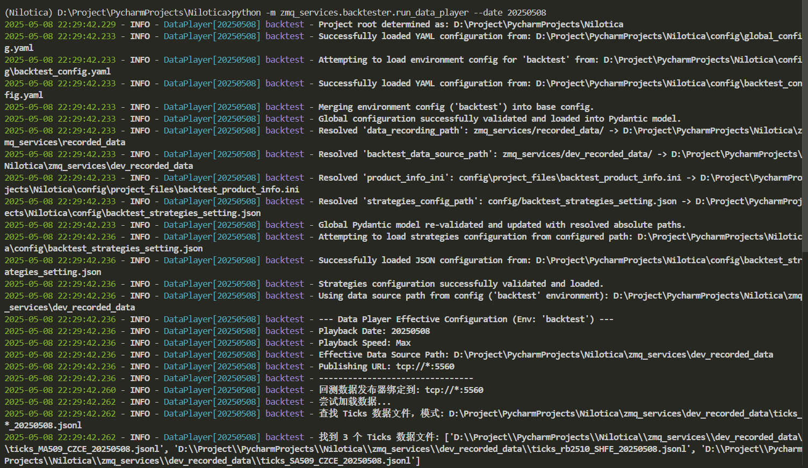
   
      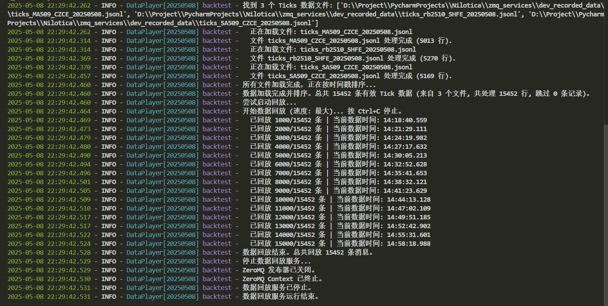

### **8. 项目进度**

| 支持 | 功能                                                         |
| :--: | ------------------------------------------------------------ |
|  ✅   | **行情网关**：连接vnpy中 CTP 网关，将行情以订阅方式发送出去。 |
|  ✅   | **订单执行网关**：处理来自策略引擎的订单请求，将请求发送到 vnpy 中 CTP 网关。 |
|  ✅   | **策略引擎**：导入策略和执行策略，将订单请求发送到订单执行网关，打印订单回报和成交回报。 |
|  ✅   | **风控管理**：维护持仓更新，持仓限制相关警报。               |
|  ✅   | **数据记录**：记录tick、order、trade、accounts、gateway_logs数据到本地。 |
|  ✅   | **策略回测**：利用数据记录器记录的历史数据对策略回测。       |
|  ✅   | **行情回放**：回放利用数据记录器记录的历史数据。             |
|  ❎   | 国际化：支持中英文。                                         |
|  ❎   | 可视化：策略、权益曲线、回撤等用web绘制出来。                |
|  ❎   | 参数化配置：将初始资金、无风险利率、年化天数等参数移到配置文件或命令行参数中。 |
|  ❎   | 性能报告：优化性能报告的计算或显示                           |
|  ❎   | 更成熟的风控管理                                             |
|  ❎   | 策略优化器                                                   |

开发中......

策略回测示例

1. 对今天的数据运行回测，以最大速度

   ```
   python -m zmq_services.backtester.run_backtest
   ```

2. 对指定日期 20250409 运行回测

   ```
   python -m zmq_services.backtester.run_backtest --date 20250409
   ```

3. 对指定日期 20250409 运行回测，在开发模式下

   ```bash
   python -m zmq_services.backtester.run_backtest --date 20250506 --config-env dev
   ```

4. 对指定日期 20250409 运行回测，指定日志输出级别

   ```
   python -m zmq_services.backtester.run_backtest --date 20250508 --log-level DEBUG
   ```

行情回放示例

1. 回放今天的数据，以最大速度。

   ```bash
   python -m zmq_services.backtester.run_data_player
   ```

3. 回放指定日期 (例如 20250409) 的数据，以接近实时的速度 (1x)

   ```bash
   python -m zmq_services.backtester.run_data_player --date 20250506 --speed 1
   ```

4. 回放指定日期的数据，以 10 倍速度

   ```bash
   python -m zmq_services.backtester.run_data_player --date 20250506 --speed 10
   ```

5. 从不同路径加载数据回放

   ```bash
   python -m zmq_services.backtester.run_data_player --date 20250506 --path /path/to/other/data
   ```

### **9. 更新日志**

[CHANGELOG.md](CHANGELOG.md)

### **10. 交流**

QQ交流群：`446042777`(澄明期货研究)

gitcode地址：https://gitcode.com/Nilotica/Nilotica

gitee地址：https://gitee.com/nilotica/Nilotica

github地址：https://github.com/Lumosylva/Nilotica

### **11. 免责声明**

1. **信息仅供参考**
   本系统所提供的信息、数据、分析、建议或其他内容（以下统称为“信息”）仅供参考，不构成任何投资建议或交易指导。用户在使用本系统时，应充分认识到期货交易的高风险性，并自行承担由此产生的任何风险和后果。
2. **不保证准确性或完整性**
   本系统所提供的信息可能来源于公开市场数据、第三方机构或其他渠道。尽管我们尽力确保信息的准确性，但无法保证其完全无误或实时更新。用户应自行核实相关信息，并对基于该信息所做出的决策负责。
3. **不承担任何责任**
   用户因使用本系统或依赖本系统所提供的信息而产生的任何直接或间接损失（包括但不限于交易损失、数据丢失、系统故障等），本系统开发者或提供方均不承担任何法律责任。
4. **系统风险与局限性**
   本系统可能存在技术故障、数据延迟、模型误差或其他不可预见的问题。用户应充分认识到量化系统的局限性，并在使用过程中保持谨慎。本系统无法保证在所有市场条件下均能有效运行。
5. **用户自主决策**
   用户在使用本系统时，应基于自身的投资目标、风险承受能力和市场判断做出独立决策。本系统不对用户的交易行为或投资结果承担任何形式的责任。
6. **遵守法律法规**
   用户在使用本系统时，应遵守相关法律法规及交易所规则。如因用户违反法律法规或交易所规则而产生的任何法律后果，均由用户自行承担。
7. **免责声明的修改权**
   本免责声明的最终解释权归本系统开发者或提供方所有。我们保留随时修改或更新本免责声明的权利，恕不另行通知。

**使用本系统即表示您同意上述免责声明的所有条款。**