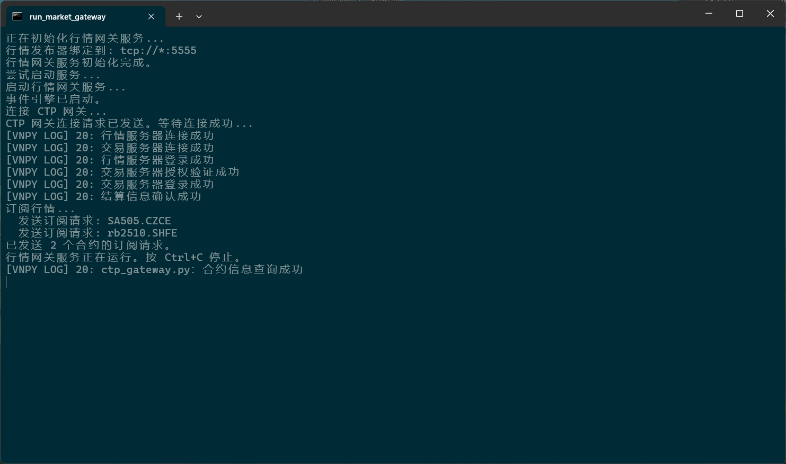
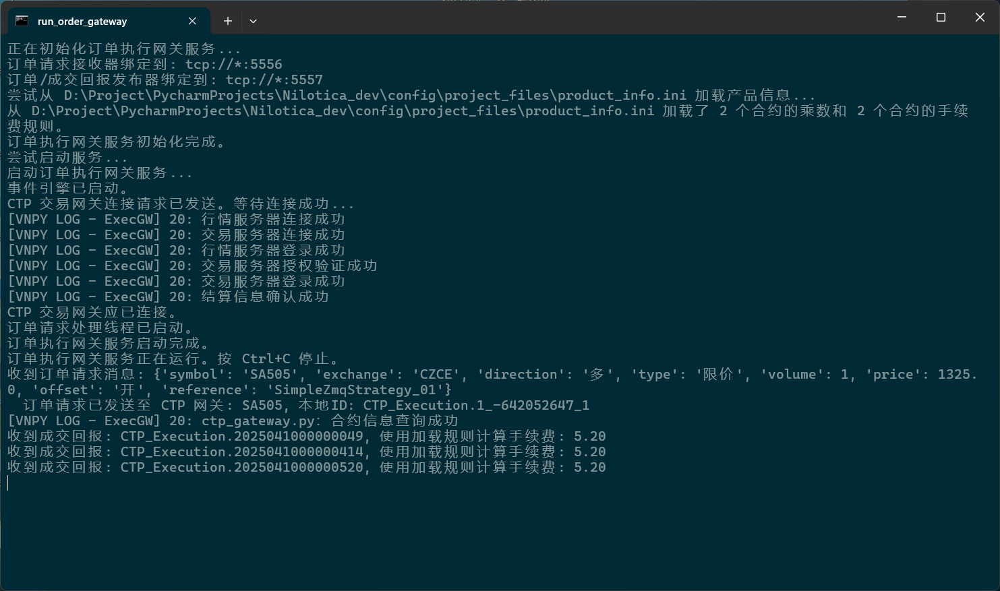
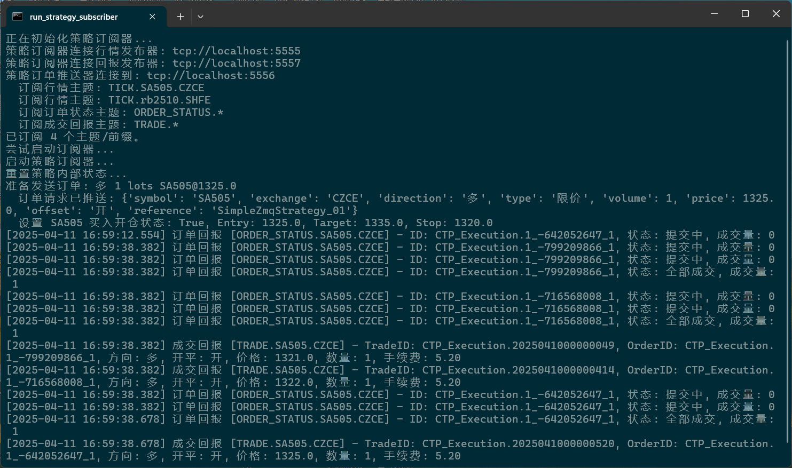
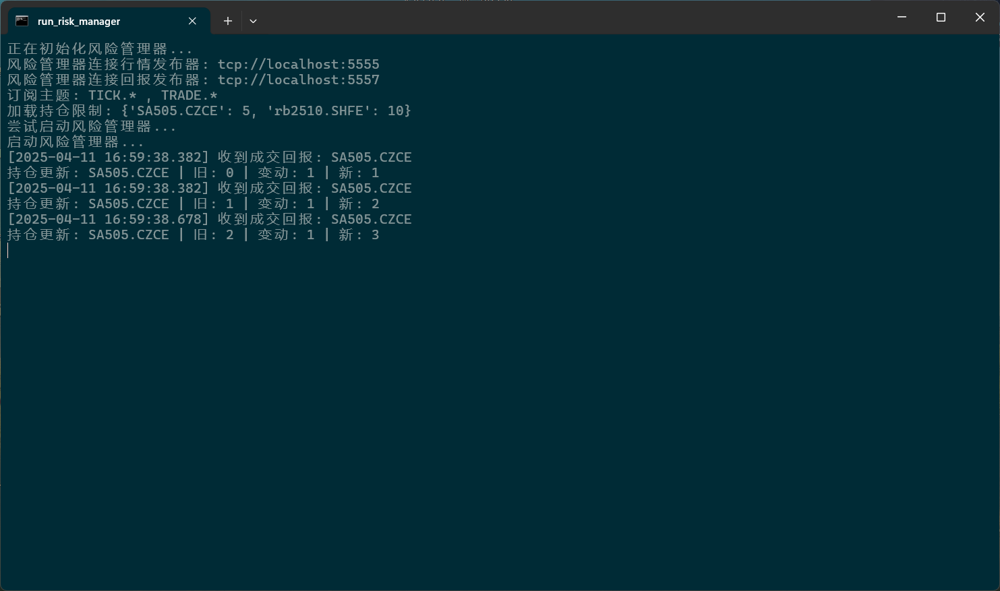
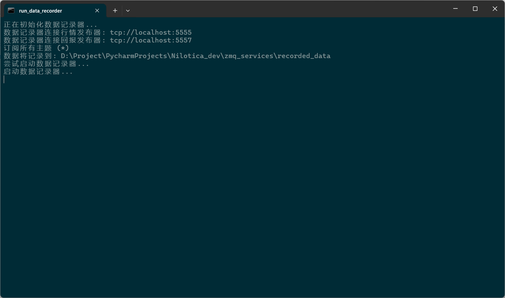
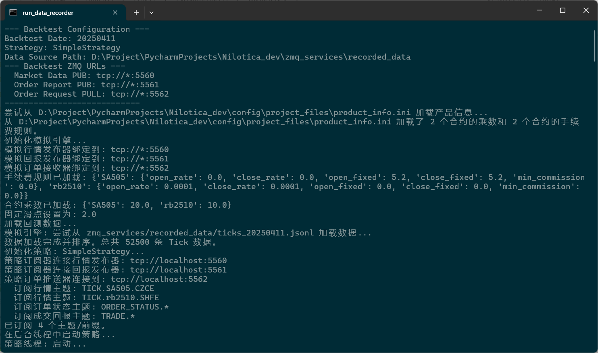
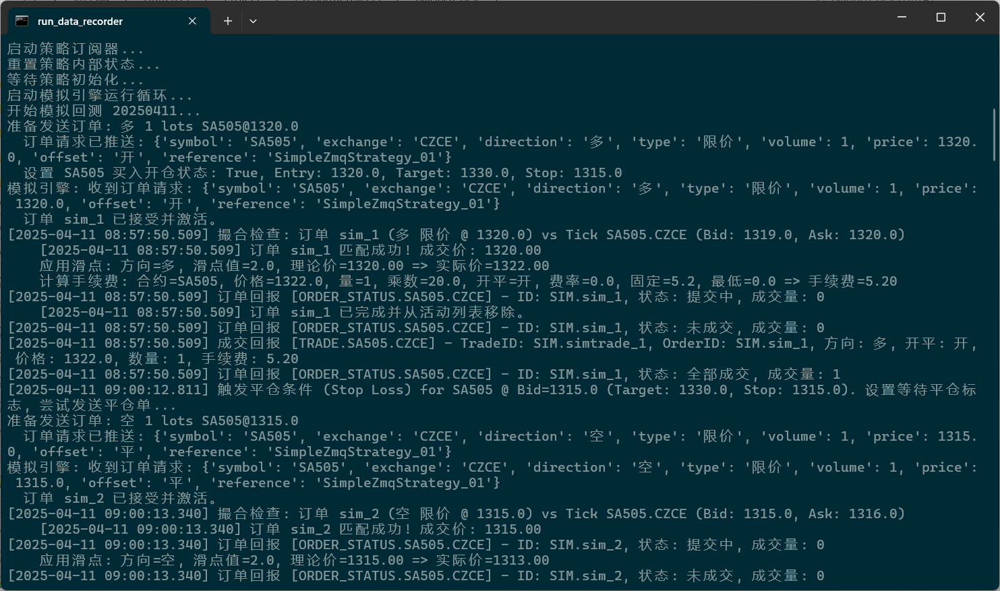
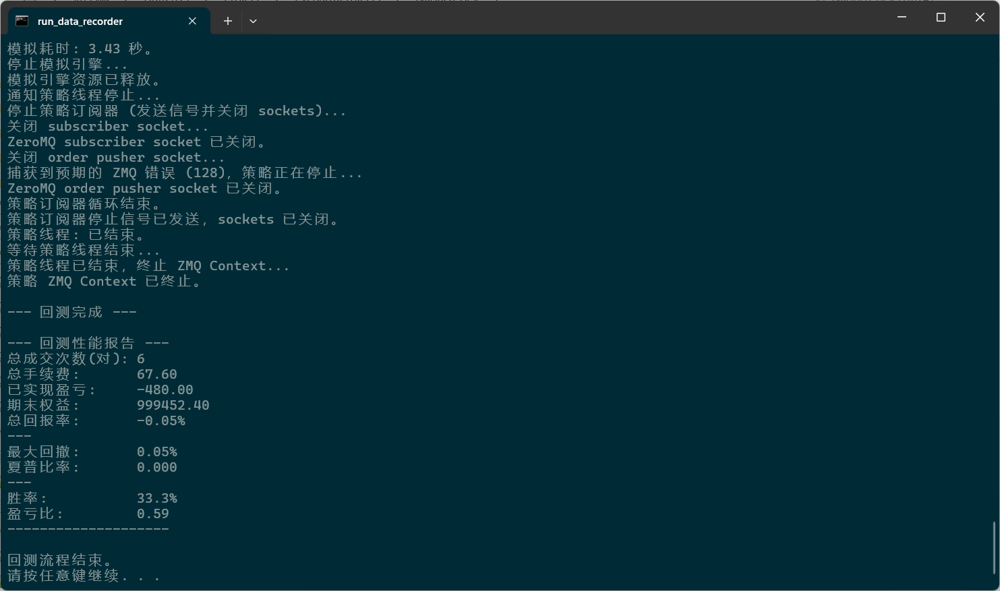

# 基于vnpy的期货量化交易系统——Nilotica

Language: [ENGLISH](README_EN.md)

------

### **1. 前言**

本项目基于 [vnpy](https://github.com/vnpy/vnpy) 和 [vnpy_ctp](https://github.com/vnpy/vnpy_ctp) 之上实现，目的是简化国内期货量化交易的上手程度，让手动交易者更容易转向量化交易，更加专注于策略的开发。

目前系统已实现的功能：

- 行情网关
- 订单执行网关
- 策略订阅器
- 风控管理
- 数据记录
- 策略回测
- 行情回放

### **2. 基础环境**

- **Python** ：`3.12.9`版本
- **工具链**：`uv` + `hatch` + `setuptools`
- **vnpy** ：`3.9.4`版本
- **vnpy_ctp**： `6.7.2.1`版本（基于**CTP 6.7.2**接口封装，接口中自带的是穿透式环境的dll文件）
- 需要进行`C++`编译，因此在执行下述命令之前请确保已经安装了`Visual Studio`（`Windows`）、`GCC`（`Linux`）
- 注意：目前所有代码仅在`Windows`环境下测试，`Linux`下并未测试

### **3. 环境配置**

本项目使用`uv`管理Python虚拟环境及依赖的软件包，`hatch`作为构建工具

1. uv安装

   On Linux

   ```bash
   curl -LsSf https://astral.sh/uv/install.sh | sh
   ```

   On Windows

   ```bash
   powershell -ExecutionPolicy ByPass -c "irm https://astral.sh/uv/install.ps1 | iex"
   ```

2. 使用 `uv sync`命令让`uv`根据`pyproject.toml`中的配置，自动进行Python虚拟环境的创建和依赖包的下载

   ```bash
   uv sync
   ```

   或不使用`uv sync`命令，手动创建虚拟环境

   ```bash
   uv venv --python 3.12.9 .venv
   ```

   激活虚拟环境

   ```bash
   .venv\Scripts\activate
   ```

### **4. 构建流程**

运行 `hatch build` 会在 vnpy_ctp\api\ 下编译出行情和交易的动态链接库 `.pyd` 文件，hatch_build.py 负责编译 C++ 扩展，构建钩子（hatch_build.py）会使用 pybind11-stubgen 为编译好的模块生成  `.pyi `存根文件，编译后的  `.pyd` 文件和  `.pyi` 文件会被包含在最终的 Wheel 包中，`hatch build`  将会生成最终的发布包。

#### **(1) 清理旧的构建**

打开终端进入项目根目录，删除`dist`、`*.egg-info`目录

PowerShell 

```bash
Remove-Item -Recurse -Force .pytest_cache, .mypy_cache, .ruff_cache, dist, build, *.egg-info -ErrorAction SilentlyContinue
```

CMD

```bash
rmdir /s /q .pytest_cache
rmdir /s /q .mypy_cache
rmdir /s /q .ruff_cache
rmdir /s /q dist
rmdir /s /q build
for /d %i in (*.egg-info) do rmdir /s /q "%i"
```

Bash

```bash
rm -rf .pytest_cache .mypy_cache .ruff_cache dist build *.egg-info
```

#### **(2) 执行构建**

```bash
hatch build
```

### **5. 项目结构**

```reStructuredText
.
├── bat - Windows BAT服务启动脚本
│   ├── 1_run_market_gateway.bat - 行情网关启动脚本
│   ├── 2_run_order_gateway.bat - 订单执行网关启动脚本
│   ├── 3_run_strategy_subscriber.bat - 策略订阅器启动脚本
│   ├── 4_run_risk_manager.bat - 风控管理启动脚本
│   ├── 5_run_data_recorder.bat - 数据记录启动脚本
│   ├── 6_run_backtest.bat - 策略回测demo脚本
├── config - 项目配置目录
│   ├── constants - 常量目录
│   │   ├── params.py - 常量
│   │   └── path.py - 路径常量
│   └── project_files - 存放节假日、合约乘数和费率、合约和交易所映射等文件目录。
├── run_image - 服务运行截图目录
├── ta-lib - ta-lib库源文件
├── utils - 工具类包
├── vnpy - vnpy官方的核心库，主要功能是事件驱动引擎，版本3.9.4。
├── vnpy_ctp - vnpy官方的ctp库，主要功能是与交易所行情和交易服务器交互。
├── vnpy_rpcservice - vnpy官方的RPC库，实现了RPC服务。
├── zmq_services - 系统核心，包括行情网关、订单执行网关、策略订阅器、风控管理、数据记录、策略回测、行情回放。
│   ├── backtester - 回测目录
│   │   ├── data_player.py - 数据回放
│   │   ├── performance.py - 计算性能指标，回测性能报告
│   │   ├── run_backtest.py - 运行回测脚本
│   │   ├── run_data_player.py - 运行数据回放脚本
│   │   └── simulation_engine.py - 模拟引擎
│   ├── recorded_data - tick、order、trader数据本地存储目录
│   ├── config.py - 项目配置文件
│   ├── data_recorder.py - 数据记录
│   ├── market_data_gateway.py - 行情网关
│   ├── order_execution_gateway.py - 订单执行网关
│   ├── risk_manager.py - 风控管理
│   ├── run_data_recorder.py - 运行数据记录脚本
│   ├── run_market_gateway.py - 运行行情网关脚本
│   ├── run_order_gateway.py - 运行订单执行网关脚本
│   ├── run_risk_manager.py - 运行风控管理脚本
│   ├── run_strategy_subscriber.py - 运行策略订阅器脚本
│   └── strategy_subscriber.py - 策略订阅器
├── .python-version - 项目使用的Python版本号，由uv自动生成不用手动编辑。
├── CHANGELOG.md - 系统版本更新日志
├── LICENSE.txt - license文件
├── README.md - 项目中文说明
├── README_EN.md - 项目英文说明
├── __init__.py - 项目的版本号
├── hatch_build.py - 自定义构建钩子负责编译 C++ 扩展
├── main.py - 项目主文件，暂时无定义
├── pyproject.toml - 项目配置文件，由uv自动生成，用于定义项目的主要依赖、元数据、构建系统等信息。
├── run.bat - 一键启动行情网关、订单执行网关、策略订阅器、风控管理、数据记录脚本
└── uv.lock - 记录项目的所有依赖，由uv自动管理，不用手动编辑。
```

### **6. 服务运行展示**

1. 运行行情网关：

   

2. 运行订单执行网关：

   

3. 运行策略订阅器：

   

4. 运行风控管理：

   

5. 运行数据记录：

   

6. 运行回测

   

   

   

### **7. 项目进度**

- [x] 行情网关

  连接vnpy中CTP网关，将行情以订阅方式发送出去。

- [x] 订单执行网关

  处理来自策略订阅器的订单请求，将请求发送到vnpy中CTP网关。

- [x] 策略订阅器

  连接到行情网关，将策略订单发送到订单执行网关，打印订单回报和成交回报。

- [x] 风控管理

  连接行情发布器(行情网关)和订单/成交回报发布器(订单执行网关)，维护持仓更新，持仓限制相关警报。

- [x] 数据记录

  连接行情发布器(行情网关)和订单/成交回报发布器(订单执行网关)，记录tick、order、trade数据到本地。

- [x] 策略回测

  1. 对今天的数据运行回测

  ```bash
  python zmq_services/backtester/run_backtest.py
  ```

  2. 对指定日期 20250409 运行回测

  ```bash
  python zmq_services/backtester/run_backtest.py --date 20250409
  ```

- [x] 行情回放

  1. 回放今天的数据，以最大速度。

     ```bash
     python zmq_services/backtester/run_data_player.py
     ```

  3. 回放指定日期 (例如 20250409) 的数据，以接近实时的速度 (1x)

     ```bash
     python zmq_services/backtester/run_data_player.py --date 20250409 --speed 1
     ```

  4. 回放指定日期的数据，以 10 倍速度

     ```bash
     python zmq_services/backtester/run_data_player.py --date 20250409 --speed 10
     ```

  5. 从不同路径加载数据回放

     ```bash
     python zmq_services/backtester/run_data_player.py --date 20250409 --path /path/to/other/data
     ```

- [ ] 更精确的成本计算：如果需要，可以实现更复杂的成本计算方法，如 FIFO 或 LIFO。

- [ ] 可视化：将权益曲线、回撤等用web绘制出来。

- [ ] 参数化配置：将初始资金、无风险利率、年化天数等参数移到配置文件或命令行参数中。

- [ ] 统计检验：对策略收益进行更严格的统计检验。

- [ ] 与其他模块集成：将性能报告与策略优化、风险管理等模块结合。

- [ ] 优化性能报告的计算或显示

- [ ] 更成熟的风控管理

- [ ] 策略优化器

开发中......

### **8. 更新日志**

[CHANGELOG.md](CHANGELOG.md)

### 9. 交流**

QQ交流群：`446042777`(澄明期货研究)

### 10. 免责声明**

1. **信息仅供参考**
   本系统所提供的信息、数据、分析、建议或其他内容（以下统称为“信息”）仅供参考，不构成任何投资建议或交易指导。用户在使用本系统时，应充分认识到期货交易的高风险性，并自行承担由此产生的任何风险和后果。
2. **不保证准确性或完整性**
   本系统所提供的信息可能来源于公开市场数据、第三方机构或其他渠道。尽管我们尽力确保信息的准确性，但无法保证其完全无误或实时更新。用户应自行核实相关信息，并对基于该信息所做出的决策负责。
3. **不承担任何责任**
   用户因使用本系统或依赖本系统所提供的信息而产生的任何直接或间接损失（包括但不限于交易损失、数据丢失、系统故障等），本系统开发者或提供方均不承担任何法律责任。
4. **系统风险与局限性**
   本系统可能存在技术故障、数据延迟、模型误差或其他不可预见的问题。用户应充分认识到量化系统的局限性，并在使用过程中保持谨慎。本系统无法保证在所有市场条件下均能有效运行。
5. **用户自主决策**
   用户在使用本系统时，应基于自身的投资目标、风险承受能力和市场判断做出独立决策。本系统不对用户的交易行为或投资结果承担任何形式的责任。
6. **遵守法律法规**
   用户在使用本系统时，应遵守相关法律法规及交易所规则。如因用户违反法律法规或交易所规则而产生的任何法律后果，均由用户自行承担。
7. **免责声明的修改权**
   本免责声明的最终解释权归本系统开发者或提供方所有。我们保留随时修改或更新本免责声明的权利，恕不另行通知。

**使用本系统即表示您同意上述免责声明的所有条款。**