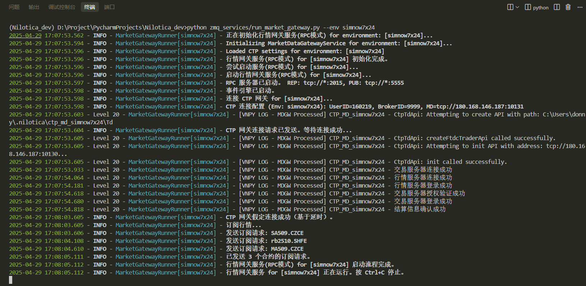
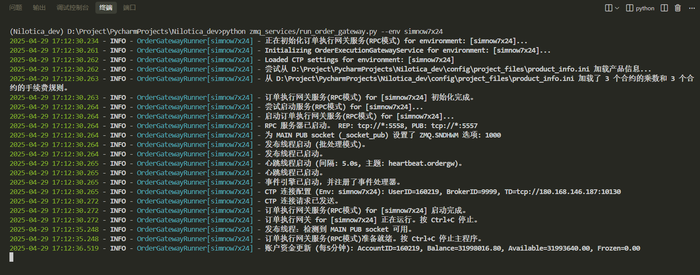
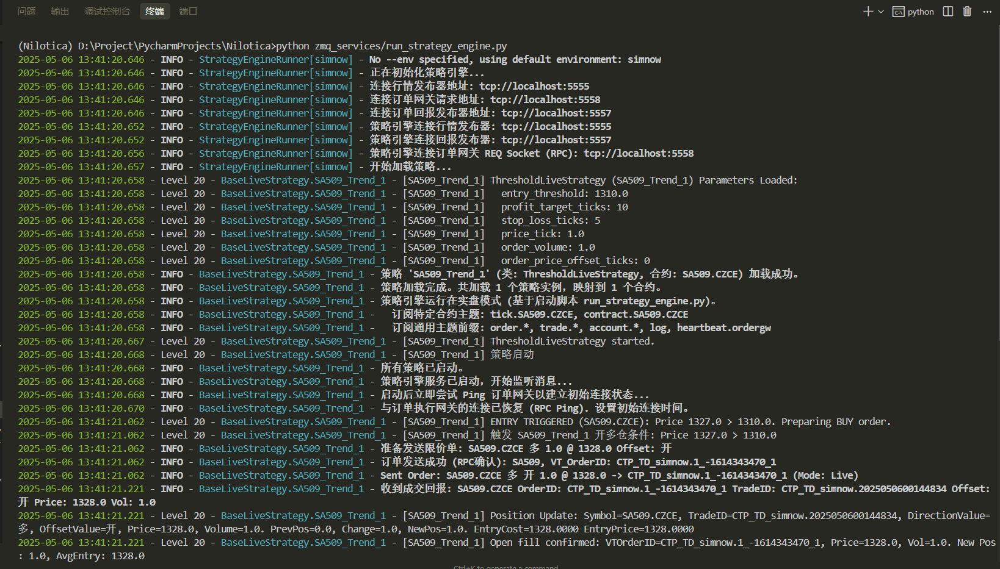
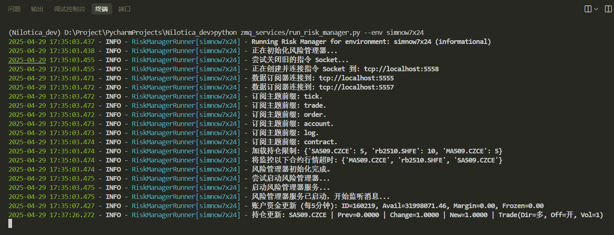
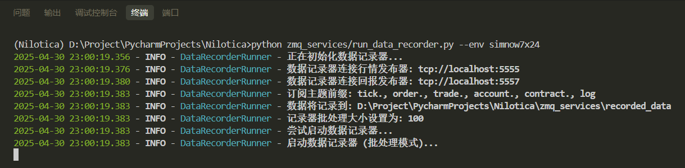
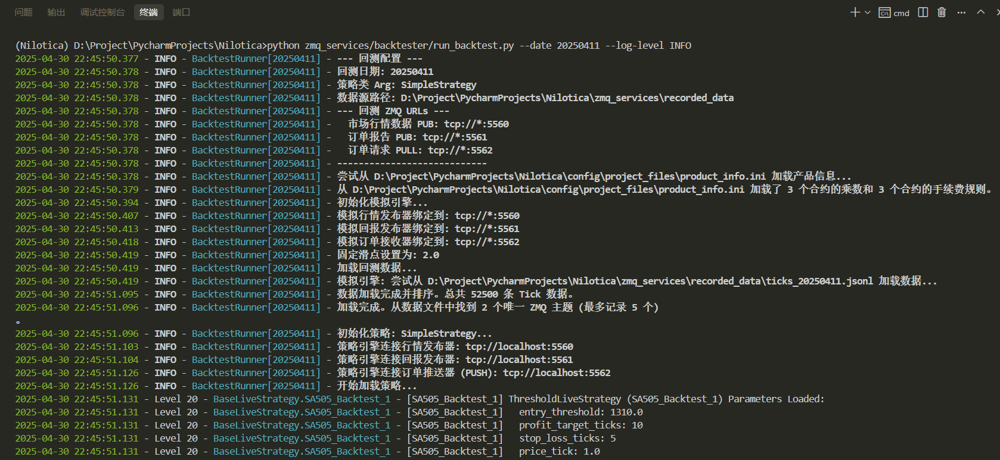
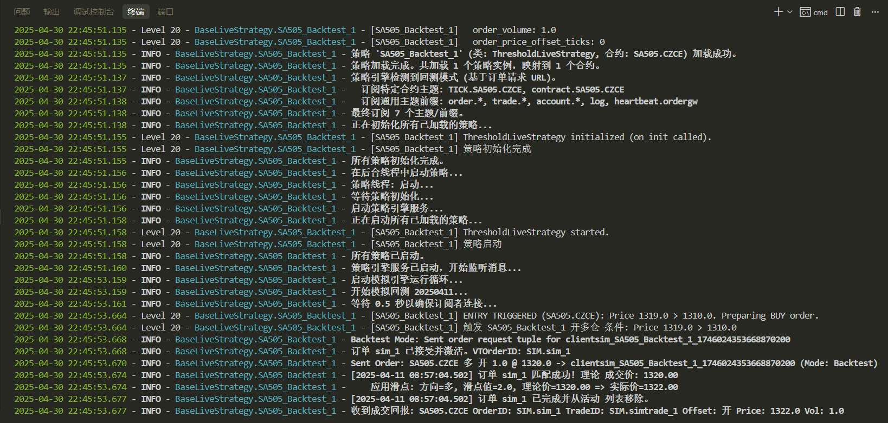
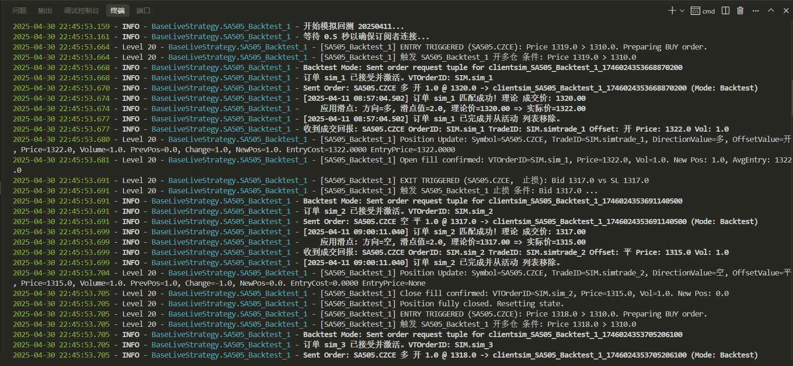
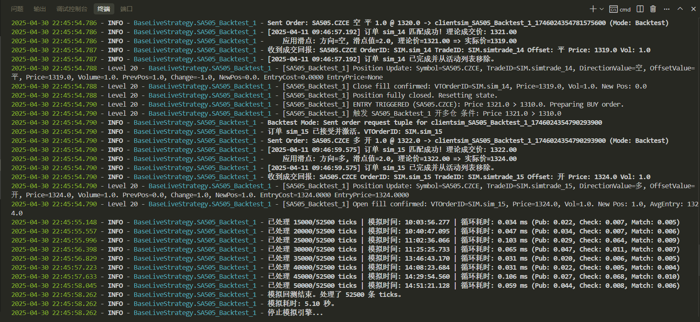
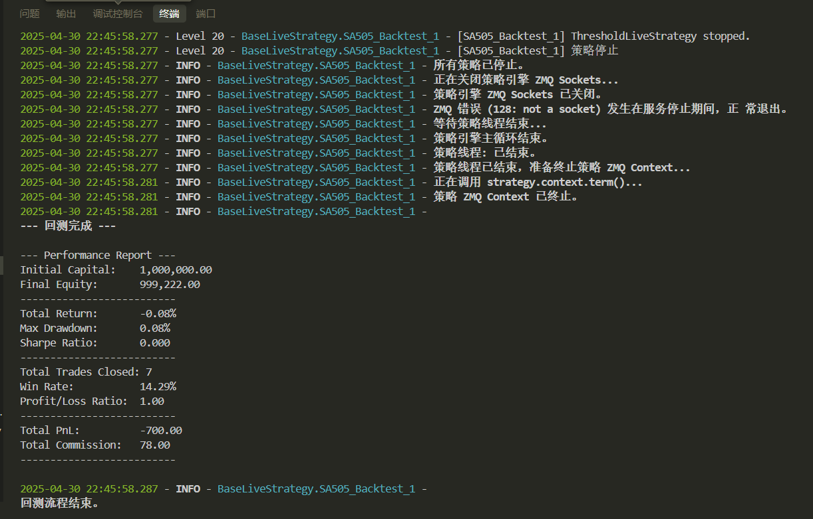

# Nilotica

Language: [CHINESE](README.md)


**A futures quantitative trading system based on vnpy**

[](https://deepwiki.com/Lumosylva/Nilotica)

------

### **1. Introduction**

This project is based on [vnpy](https://github.com/vnpy/vnpy) and [vnpy_ctp](https://github.com/vnpy/vnpy_ctp) , and aims to simplify the domestic futures quantitative trading experience, making it easier for manual traders to switch to quantitative trading and focus more on strategy development.

The functions currently implemented by the system are:

- Market Gateway
- Order Execution Gateway
- Strategy Engine
- Risk control management
- Data Recording
- Strategy backtesting
- Market playback

### **2. Basic Environment**

- **Python** : `3.12.9` version
- **Toolchain**: `uv` + `hatch` + `setuptools`
- **vnpy** : version `4.0.0`
- **vnpy_ctp**: `6.7.7.1` version (developed based on the `6.7.7` interface package of CTP futures version, the interface comes with the dll file of [penetrating real disk environment])
- If you need to compile other versions of CTP `C++`, you need to make sure you have installed `Visual Studio` (`Windows`), `GCC` (`Linux`) before executing the following command

- If you use the CTP version of this system directly, you do not need to follow the build process in step 4 below. You can directly download the `whl` uv pip install in the release package and install it.

  https://github.com/Lumosylva/Nilotica/releases

- Note: Currently all codes are only tested under `Windows` environment, not under `Linux`

### **3. Description**

This project modifies the files in the `vnpy` library

1. vnpy/trader/utility.py:

    ```python
    TRADER_DIR, TEMP_DIR = _get_trader_dir(".nilotica")
    ```

​		Prevent conflicts with other vnpy projects on the local machine when using the same user configuration directory

2. vnpy_ctp/gateway/ctp_gateway.py:

   Add try...except... in the connect function to catch exceptions

3. vnpy/rpc/server.py:

   The stop function adds self._socket_rep.close(), self.socket_pub.close(), and self._context.term(), which are called after closing the socket to terminate the ZMQ context.

### **4. Environment Configuration**

This project uses `uv` to manage Python virtual environments and dependent packages, and `hatch` as a build tool

1. UV installation

   On Linux

   ```bash
   curl -LsSf https://astral.sh/uv/install.sh | sh
   ```

   On Windows

   ```bash
   powershell -ExecutionPolicy ByPass -c "irm https://astral.sh/uv/install.ps1 | iex"
   ```

2. Use the `uv sync` command to let `uv` automatically create a Python virtual environment and download dependent packages according to the configuration in `pyproject.toml`

   ```bash
   uv sync
   ```

   Or do not use the `uv sync` command and manually create a virtual environment

   ```bash
   uv venv --python 3.12.9 .venv
   ```

   Activate the virtual environment

   ```bash
   .venv\Scripts\activate
   ```
2. Install ta_lib library

   ```bash
   .\build.bat
   ```

   or

   ```bash
   .\build.sh
   ```

### **5. Compile VNPY_CTP**

When `vnpy_ctp` needs to be compiled, executing the `hatch build` command will use the `hatch_build.py` build script under the project vnpy_ctp\api\ to compile the vnctpmd and vnctptd modules into .pyd files (on Windows) or .so files (on Linux), and generate the corresponding Python interface stub files (.pyi). The script uses the pybind11 library to simplify the binding process between C++ and Python, and performs the build operation through setuptools and hatchling.

When `vnpy_tts` needs to be compiled, please modify the `path` of the `[tool.hatch.build.hooks.custom]` build script in `pyproject.toml` to `hatch_build_tts.py`, and then execute `hatch build` to compile a similar process as above.

#### **(1) Clean up old builds**

Open the terminal and enter the project root directory, delete the `dist` and `build` directories

PowerShell

```bash
Remove-Item -Recurse -Force dist, build -ErrorAction SilentlyContinue
```

CMD

```bash
rmdir /s /q dist
rmdir /s /q build
```

Bash

```bash
rm -rf dist build
```

#### **(2) Execute the build**

Method 1:

```bash
build.bat
```

or

```bash
build.sh
```

Method 2:

Enter the project root directory, add the ta-lib source file directory to the temporary environment variable (set it to your actual path), and then execute hatch build

```bash
set TA_INCLUDE_PATH=D:\Project\PycharmProjects\Nilotica_dev\ta-lib\include
set TA_LIBRARY_PATH=D:\Project\PycharmProjects\Nilotica_dev\ta-lib\lib
```

or

```bash
export TA_INCLUDE_PATH="$PATH:/ta-lib/include"
export TA_LIBRARY_PATH="$PATH:/ta-lib/lib"
```

```bash
hatch build
```

### **6. Project Structure**

```reStructuredText
.
├── assets - screenshots of service operation
├── bat - Windows BAT service startup script
│ ├── 1_run_market_gateway.bat - Market gateway startup script
│ ├── 2_run_order_gateway.bat - Order execution gateway startup script
│ ├── 3_run_strategy_engine.bat - Strategy subscriber startup script
│ ├── 4_run_risk_manager.bat - Risk management startup script
│ ├── 5_run_data_recorder.bat - Data recording startup script
│ └── 6_run_backtest.bat - Strategy backtesting demo script
├── config - Project configuration directory
│ ├── constants - Constant directory
│ │ ├── params.py - Constants
│ │ └── path.py - Path constants
│ └── project_files - directory for storing holidays, contract multipliers and rates, contract and exchange mapping, etc.
├── ta-lib - ta-lib library source files
├── utils - tool package, including logs, paths, etc.
├── vnpy - vnpy's official core library, the main function is the event-driven engine.
├── vnpy_ctp - vnpy's official ctp library, the main function is to provide an interface for the underlying interaction with the market and trading servers.
├── vnpy_tts - vnpy's official tts library, its main function is to provide an interface for interacting with tts, real market information and trading servers.
├── zmq_services - system core, including market gateway, order execution gateway, strategy subscriber, risk control management, data recording, strategy backtesting, market playback.
│ ├── backtester - backtest directory
│ │ ├── data_player.py - data playback
│ │ ├── performance.py - calculate performance indicators, backtest performance report
│ │ ├── run_backtest.py - run backtest script
│ │ ├── run_data_player.py - run data playback script
│ │ └── simulation_engine.py - simulation engine
│ ├── strategies - strategy storage location
│ ├── recorded_data - local storage directory for accounts, ticks, orders, and trader data
│ ├── config.py - project configuration file
│ ├── data_recorder.py - data recorder
│ ├── market_data_gateway.py - market gateway
│ ├── order_execution_gateway.py - order execution gateway
│ ├── risk_manager.py - Risk Control Manager
│ ├── rpc_client_test.py - Order test script
│ ├── run_data_recorder.py - Data recorder startup script
│ ├── run_market_gateway.py - Market gateway startup script
│ ├── run_order_gateway.py - Order execution gateway startup script
│ ├── run_risk_manager.py - Risk control manager startup script
│ ├── run_strategy_engine.py - Strategy engine startup script
│ ├── strategy_base.py - Strategy base class
│ └── strategy_subscriber.py - Strategy subscriber
├── .python-version - Python version number used by the project, automatically generated by uv and does not need to be manually edited.
├── CHANGELOG.md - System version update log
├── LICENSE.txt - License file
├── README.md - Project description in Chinese
├── README_EN.md - Project description in English
├── __init__.py - Project version number
├── banner.png - Project banner image
├── build.bat - Windows project automatic build script
├── build.sh - Linux project automatic build script
├── hatch_build.py - The vnpy_ctp build script is responsible for compiling the C++ extension
├── hatch_build_tts.py - The vnpy_tts build script is responsible for compiling the C++ extension
├── install.bat - Windows installation script for ta-lib 0.6.3
├── install.sh - Linux installation script for ta-lib 0.6.3
├── main.py - Main project file, no definition for now
├── pyproject.toml - Project configuration file, automatically generated by uv, used to define the main dependencies, metadata, build system and other information of the project.
├── run.bat - One-click startup of market gateway, order execution gateway, strategy subscriber, risk control management, data recording script
└── uv.lock - Records all dependencies of the project, automatically managed by uv, no manual editing required.
```

### **7. Service operation display**

1. Run the market gateway:



2. Run the order execution gateway:



3. Run the strategy engine:



4. Operational risk control management:



5. Operation data recording:



6. Run the backtest











### **8. Project Progress**

- [x] Market Gateway

Connect to the CTP gateway in vnpy and send the market information in a subscription manner.

- [x] Order Execution Gateway

Process order requests from strategy subscribers and send the requests to the CTP gateway in vnpy.

- [x] Strategy Engine

  Connect to the market gateway, import strategies and execute strategies, send orders to the order execution gateway, and print order reports and transaction reports.

- [x] Risk Control Management

Connect the market information publisher (market information gateway) and the order/transaction report publisher (order execution gateway) to maintain position updates and position limit related alerts.

- [x] Data Record

Connect the market information publisher (market information gateway) and the order/transaction report publisher (order execution gateway) to record tick, order, and trade data locally.

- [x] Strategy Backtesting

1. Run a backtest on today’s data

     ```bash
     python zmq_services/backtester/run_backtest.py
     ```

2. Run the backtest on the specified date 20250409

     ```bash
     python zmq_services/backtester/run_backtest.py --date 20250409
     ```

- [x] Market Replay

1. Replay today's data at maximum speed.

     ```bash
     python -m zmq_services.backtester.run_data_player
     ```

3. Play back data from a specified date (e.g. 20250409) at near real-time speed (1x)

     ```bash
     python -m zmq_services.backtester.run_data_player --date 20250506 --speed 1
     ```

  4. Play back the data of the specified date at 10 times the speed

     ```bash
     python -m zmq_services.backtester.run_data_player --date 20250506 --speed 10
     ```

  5. Load data from different paths for playback

     ```bash
     python -m zmq_services.backtester.run_data_player --date 20250506 --path /path/to/other/data
     ```

- [ ] More precise costing: If needed, more complex costing methods such as FIFO or LIFO can be implemented.

- [ ] Visualization: Draw equity curves, drawdowns, etc. using the web.

- [ ] Parameterized configuration: Move parameters such as initial capital, risk-free rate, annualized days, etc. to configuration files or command line parameters.

- [ ] Statistical tests: Perform more rigorous statistical tests on strategy returns.

- [ ] Integration with other modules: Combine performance reporting with modules such as strategy optimization, risk management, etc.

- [ ] Optimize the calculation or display of performance reports

- [ ] More mature risk control management

- [ ] Strategy Optimizer

Under development...

### **9. Update log**

[CHANGELOG.md](CHANGELOG.md)

### **10. Communication**

QQ exchange group: `446042777` (Chengming Futures Research)

Gitcode address: https://gitcode.com/Nilotica/Nilotica

GitHub address: https://github.com/Lumosylva/Nilotica

### **11. Disclaimer**

1. **Information is for reference only**
The information, data, analysis, advice or other content (hereinafter collectively referred to as "Information") provided by this system is for reference only and does not constitute any investment advice or trading guidance. When using this system, users should fully realize the high risk of futures trading and bear any risks and consequences arising therefrom.
2. **NO WARRANTY OF ACCURACY OR COMPLETENESS**
The information provided by this system may come from public market data, third-party institutions or other channels. Although we do our best to ensure the accuracy of the information, we cannot guarantee that it is completely error-free or up-to-date. Users should verify the relevant information on their own and are responsible for the decisions made based on such information.
3. **No liability**
The developer or provider of this system shall not bear any legal responsibility for any direct or indirect losses (including but not limited to transaction losses, data loss, system failure, etc.) caused by the user's use of this system or reliance on the information provided by this system.
4. **System risks and limitations**
This system may have technical failures, data delays, model errors or other unforeseen problems. Users should be fully aware of the limitations of the quantification system and exercise caution in their use. This system cannot be guaranteed to operate effectively under all market conditions.
5. **Users make their own decisions**
When using this system, users should make independent decisions based on their own investment objectives, risk tolerance and market judgment. This system does not assume any form of responsibility for users' trading behavior or investment results.
6. **Comply with laws and regulations**
When using this system, users should abide by relevant laws, regulations and exchange rules. Any legal consequences arising from the user's violation of laws, regulations or exchange rules shall be borne by the user himself.
7. **Right to modify the Disclaimer**
The final right of interpretation of this disclaimer belongs to the developer or provider of this system. We reserve the right to modify or update this Disclaimer at any time without prior notice.

**By using this system, you agree to all the terms of the above disclaimer. **