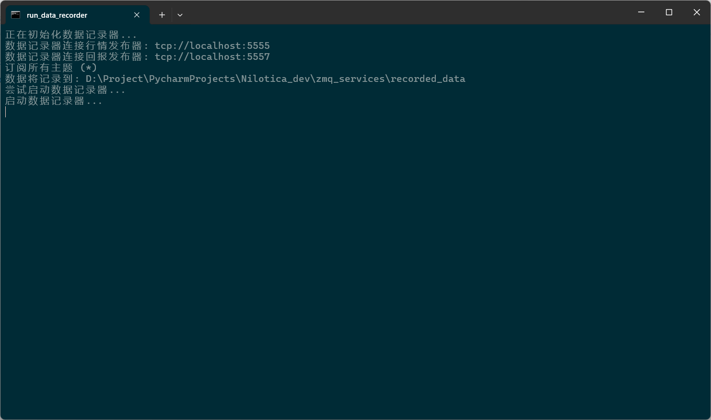
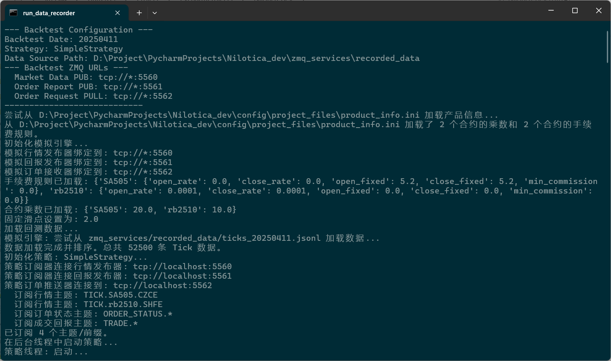
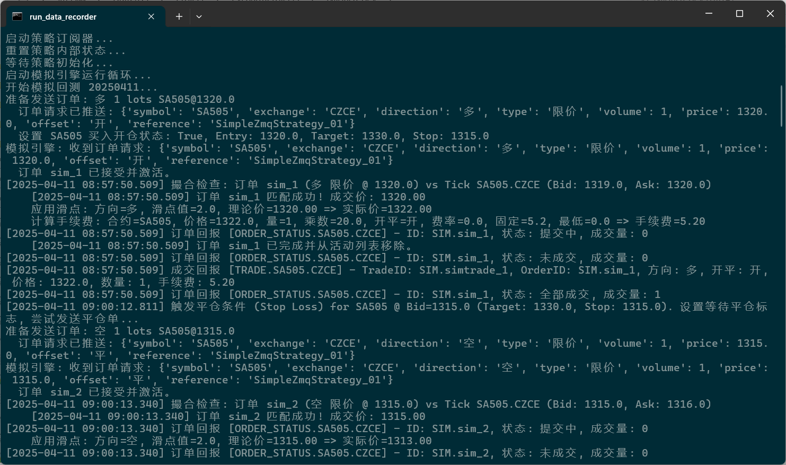

# Nilotica

Language: [CHINESE](README.md)


**A futures quantitative trading system based on vnpy**

------

### **1. Introduction**

This project is based on **[vnpy](https://github.com/vnpy/vnpy)**, **[vnpy_ctp](https://github.com/vnpy/vnpy_ctp) **, **[vnpy_rpcservice](https://github.com/vnpy/vnpy_rpcservice)**, and aims to simplify the domestic futures quantitative trading experience, making it easier for manual traders to switch to quantitative trading and focus more on strategy development.

The functions currently implemented by the system are:

- Market Gateway
- Order Execution Gateway
- Strategy Subscriber
- Risk control management
- Data Recording
- Strategy backtesting
- Market playback

### **2. Basic Environment**

- **Python** : `3.12.9` version
- **Toolchain**: `uv` + `hatch` + `setuptools`
- **vnpy** : version `4.0.0`
- **vnpy_ctp**: `6.7.7.1` version (developed based on the `6.7.7` interface package of CTP futures version, the interface comes with the dll file of [penetrating real disk environment])
- **vnpy_rpcservice**: version 1.0.6

- If you need to compile other versions of CTP `C++`, you need to make sure you have installed `Visual Studio` (`Windows`), `GCC` (`Linux`) before executing the following command

- If you use the CTP version of this system directly, you do not need to follow the build process in step 4 below. You can directly download the `whl` uv pip install in the release package and install it.

  https://github.com/Ma-Dongdong/Nilotica_dev/releases

- Note: Currently all codes are only tested under `Windows` environment, not under `Linux`

### **3. Description**

In order to prevent conflicts with other vnpy projects on the local machine when using the same user configuration directory, this project modifies the files in the `vnpy` library:

vnpy/trader/utility.py

Original code:

```Python
TRADER_DIR, TEMP_DIR = _get_trader_dir(".vntrader")
```

After the change:

```Python
TRADER_DIR, TEMP_DIR = _get_trader_dir(".nilotica")
```

### **4. Environment Configuration**

This project uses `uv` to manage Python virtual environments and dependent packages, and `hatch` as a build tool

1. UV installation

On Linux

```bash
curl -LsSf https://astral.sh/uv/install.sh | sh
```

On Windows

```bash
powershell -ExecutionPolicy ByPass -c "irm https://astral.sh/uv/install.ps1 | iex"
```

2. Use the `uv sync` command to let `uv` automatically create a Python virtual environment and download dependent packages according to the configuration in `pyproject.toml`

```bash
uv sync
```

Or do not use the `uv sync` command and manually create a virtual environment

```bash
uv venv --python 3.12.9 .venv
```

Activate the virtual environment

```bash
.venv\Scripts\activate
```

### **5. Build Process**

The `hatch build` command will compile the dynamic link library `.pyd` file of the market and transaction under vnpy_ctp\api\. hatch_build.py is responsible for compiling C++ extensions. The build hook (hatch_build.py) will use pybind11-stubgen to generate `.pyi` stub files for the compiled modules. The compiled `.pyd` and `.pyi` files will be included in the final Wheel package. `hatch build` will generate the final release package. If you need to perform CTP compilation, you can perform this build process, otherwise you do not need to do it.

#### **(1) Clean up old builds**

Open the terminal and enter the project root directory, delete the `dist` and `*.egg-info` directories

PowerShell

```bash
Remove-Item -Recurse -Force .pytest_cache, .mypy_cache, .ruff_cache, dist, build, *.egg-info -ErrorAction SilentlyContinue
```

CMD

```bash
rmdir /s /q .pytest_cache
rmdir /s /q .mypy_cache
rmdir /s /q .ruff_cache
rmdir /s /q dist
rmdir /s /q build
for /d %i in (*.egg-info) do rmdir /s /q "%i"
```

Bash

```bash
rm -rf .pytest_cache .mypy_cache .ruff_cache dist build *.egg-info
```

#### **(2) Execute the build**

Method 1:

```bash
build.bat
```

or

```bash
install.sh
```

Method 2:

Enter the project root directory, add the ta-lib source file directory to the temporary environment variable (set it to your actual path), and then execute hatch build

```bash
set TA_INCLUDE_PATH=D:\Project\PycharmProjects\Nilotica_dev\ta-lib\include
set TA_LIBRARY_PATH=D:\Project\PycharmProjects\Nilotica_dev\ta-lib\lib
```

or

```bash
export TA_INCLUDE_PATH="$PATH:/ta-lib/include"
export TA_LIBRARY_PATH="$PATH:/ta-lib/lib"
```

```bash
hatch build
```

### **6. Project Structure**

```reStructuredText
.
├── bat - Windows BAT service startup script
│ ├── 1_run_market_gateway.bat - Market gateway startup script
│ ├── 2_run_order_gateway.bat - Order execution gateway startup script
│ ├── 3_run_strategy_subscriber.bat - Strategy subscriber startup script
│ ├── 4_run_risk_manager.bat - Risk management startup script
│ ├── 5_run_data_recorder.bat - Data recording startup script
│ └── 6_run_backtest.bat - Strategy backtest demo script
├── config - project configuration directory
├── logger - logging module
├── logs - log storage directory
│ ├── constants - constants directory
│ │ ├── params.py - constants
│ │ └── path.py - path constants
│ └── project_files - This directory contains files such as holidays, contract multipliers and rates, contract and exchange mappings, etc.
├── run_image - service running screenshot directory
├── structlog - another log module, temporarily unused
├── ta-lib - ta-lib library source files
├── utils - utility package
├── vnpy - vnpy's official core library, whose main function is an event-driven engine.
├── vnpy_ctp - vnpy's official ctp library, its main function is to interact with exchange quotes and trading servers.
├── vnpy_rpcservice - vnpy's official RPC library, its main function is to provide RPC services.
├── zmq_services - the core of the system, including market gateway, order execution gateway, strategy subscriber, risk control management, data recording, strategy backtesting, and market playback.
│ ├── backtester - Backtesting directory
│ │ ├── data_player.py - data playback
│ │ ├── performance.py - calculates performance indicators and backtests performance reports
│ │ ├── run_backtest.py - Run the backtest script
│ │ ├── run_data_player.py - Run the data playback script
│ │ └── simulation_engine.py - simulation engine
│ ├── recorded_data - local storage directory for tick, order, and trader data
│ ├── config.py - project configuration file
│ ├── data_recorder.py - Data Recording
│ ├── market_data_gateway.py - Market data gateway
│ ├── order_execution_gateway.py - Order Execution Gateway
│ ├── risk_manager.py - Risk management
│ ├── run_data_recorder.py - Run the data recording script
│ ├── run_market_gateway.py - Run the market gateway script
│ ├── run_order_gateway.py - Runs the order execution gateway script
│ ├── run_risk_manager.py - Run the risk management script
│ ├── run_strategy_subscriber.py - Runs the strategy subscriber script
│ └── strategy_subscriber.py - Strategy Subscriber
├── .python-version - The Python version number used by the project, automatically generated by uv and does not need to be manually edited.
├── CHANGELOG.md - System version change log
├── LICENSE.txt - license file
├── README.md - Project description in Chinese
├── README_EN.md - English description of the project
├── __init__.py - the project version number
├── hatch_build.py - custom build hook responsible for compiling C++ extensions
├── build.bat - Windows project automatic build script
├── build.sh - Linux project automatic build script
├── install.bat - Windows installation script for ta-lib 0.6.3, temporarily useless
├── install.sh - script for installing ta-lib 0.6.3 on Linux, temporarily useless
├── logo.png - project logo
├── main.py - main file of the project, no definition yet
├── pyproject.toml - project configuration file, automatically generated by uv, used to define the project's main dependencies, metadata, build system and other information.
├── run.bat - one-click start of the market gateway, order execution gateway, strategy subscriber, risk control management, and data recording scripts
└── uv.lock - records all dependencies of the project, which is automatically managed by uv and does not require manual editing.
```

### **7. Service operation display**

1. Run the market gateway:


2. Run the order execution gateway:


3. Run the strategy subscriber:


4. Operational risk control management:


5. Operation data recording:



6. Run the backtest






### **8. Project Progress**

- [x] Market Gateway

Connect to the CTP gateway in vnpy and send the market information in a subscription manner.

- [x] Order Execution Gateway

Process order requests from strategy subscribers and send the requests to the CTP gateway in vnpy.

- [x] Strategy Subscriber

Connect to the market gateway, send strategy orders to the order execution gateway, and print order reports and transaction reports.

- [x] Risk Control Management

Connect the market information publisher (market information gateway) and the order/transaction report publisher (order execution gateway) to maintain position updates and position limit related alerts.

- [x] Data Record

Connect the market information publisher (market information gateway) and the order/transaction report publisher (order execution gateway) to record tick, order, and trade data locally.

- [x] Strategy Backtesting

1. Run a backtest on today’s data

     ```bash
     python zmq_services/backtester/run_backtest.py
     ```

2. Run the backtest on the specified date 20250409

     ```bash
     python zmq_services/backtester/run_backtest.py --date 20250409
     ```

- [x] Market Replay

1. Replay today's data at maximum speed.

     ```bash
     python zmq_services/backtester/run_data_player.py
     ```

3. Play back data from a specified date (e.g. 20250409) at near real-time speed (1x)

     ```bash
     python zmq_services/backtester/run_data_player.py --date 20250409 --speed 1
     ```

  4. Play back the data of the specified date at 10 times the speed

     ```bash
     python zmq_services/backtester/run_data_player.py --date 20250409 --speed 10
     ```

  5. Load data from different paths for playback

     ```bash
     python zmq_services/backtester/run_data_player.py --date 20250409 --path /path/to/other/data
     ```

- [ ] More precise costing: If needed, more complex costing methods such as FIFO or LIFO can be implemented.

- [ ] Visualization: Draw equity curves, drawdowns, etc. using the web.

- [ ] Parameterized configuration: Move parameters such as initial capital, risk-free rate, annualized days, etc. to configuration files or command line parameters.

- [ ] Statistical tests: Perform more rigorous statistical tests on strategy returns.

- [ ] Integration with other modules: Combine performance reporting with modules such as strategy optimization, risk management, etc.

- [ ] Optimize the calculation or display of performance reports

- [ ] More mature risk control management

- [ ] Strategy Optimizer

Under development...

### **9. Update log**

[CHANGELOG.md](CHANGELOG.md)

### **10. Communication**

QQ exchange group: `446042777` (Chengming Futures Research)

Gitcode address: https://gitcode.com/Nilotica/Nilotica_dev

GitHub address: https://github.com/Ma-Dongdong/Nilotica_dev

### **11. Disclaimer**

1. **Information is for reference only**
The information, data, analysis, advice or other content (hereinafter collectively referred to as "Information") provided by this system is for reference only and does not constitute any investment advice or trading guidance. When using this system, users should fully realize the high risk of futures trading and bear any risks and consequences arising therefrom.
2. **NO WARRANTY OF ACCURACY OR COMPLETENESS**
The information provided by this system may come from public market data, third-party institutions or other channels. Although we do our best to ensure the accuracy of the information, we cannot guarantee that it is completely error-free or up-to-date. Users should verify the relevant information on their own and are responsible for the decisions made based on such information.
3. **No liability**
The developer or provider of this system shall not bear any legal responsibility for any direct or indirect losses (including but not limited to transaction losses, data loss, system failure, etc.) caused by the user's use of this system or reliance on the information provided by this system.
4. **System risks and limitations**
This system may have technical failures, data delays, model errors or other unforeseen problems. Users should be fully aware of the limitations of the quantification system and exercise caution in their use. This system cannot be guaranteed to operate effectively under all market conditions.
5. **Users make their own decisions**
When using this system, users should make independent decisions based on their own investment objectives, risk tolerance and market judgment. This system does not assume any form of responsibility for users' trading behavior or investment results.
6. **Comply with laws and regulations**
When using this system, users should abide by relevant laws, regulations and exchange rules. Any legal consequences arising from the user's violation of laws, regulations or exchange rules shall be borne by the user himself.
7. **Right to modify the Disclaimer**
The final right of interpretation of this disclaimer belongs to the developer or provider of this system. We reserve the right to modify or update this Disclaimer at any time without prior notice.

**By using this system, you agree to all the terms of the above disclaimer. **